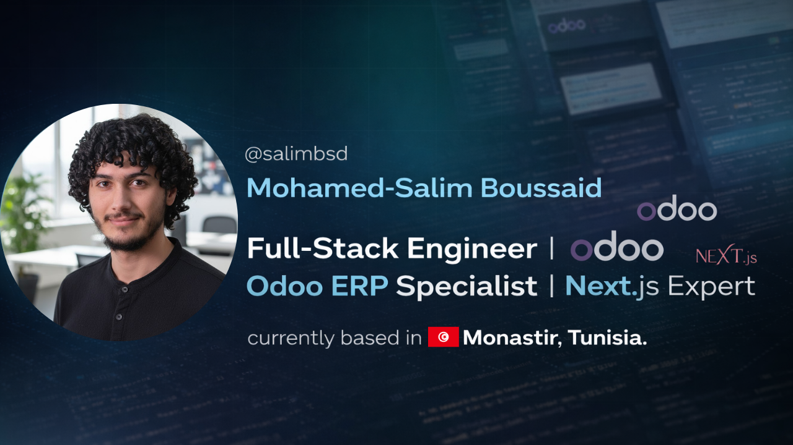

<!-- =============================== -->
<!-- 🌌 Professional Header -->
<!-- =============================== -->

  

 

<!-- =============================== -->

<!-- 🚀 About Me with Coding Animation -->

<!-- =============================== -->

<h2 align="center">🚀 About Me</h2>

<table align="center" border="0" width="100%">
  <tr>
    <td width="55%" valign="top">
    
       
      As a passionate <b>Full-Stack Engineer</b> & <b>Odoo Specialist</b>, I craft seamless digital experiences that solve real-world problems.
        
      <ul>
        <li>🌍 <b>Based in:</b> Yekaterinburg, Russia (Open to Remote)</li>
        <li>🔭 <b>Building:</b> Next-Gen AI Recruitment Platforms</li>
        <li>🌱 <b>Stack:</b> React 19, Next.js 15, Odoo 16, Python</li>
        <li>💼 <b>Status:</b> Ready for new challenges</li>
      </ul>
    </td>
    <td width="45%" align="center">
      
        
      
    </td>
  </tr>
</table>

<!-- ✨ Animated Divider -->

  

<!-- =============================== -->

<!-- 📬 Connect With Me (Animated Hover Badges) -->

<!-- =============================== -->

<h2 align="center">📬 Connect With Me</h2>

  
  
  
  
  
  

<!-- ✨ Animated Divider -->

  

<!-- =============================== -->

<!-- 🛠️ Technical Arsenal (Pro Icons) -->

<!-- =============================== -->

<h2 align="center">🛠️ Technical Arsenal</h2>

  <table border="0">
    <tr>
      <td align="center" width="120"><b>Frontend</b></td>
      <td align="left">
        
      </td>
    </tr>
    <tr>
      <td align="center"><b>Backend</b></td>
      <td align="left">
        
      </td>
    </tr>
    <tr>
      <td align="center"><b>ERP & AI</b></td>
      <td align="left">
        
        
        
        
      </td>
    </tr>
    <tr>
      <td align="center"><b>Tools</b></td>
      <td align="left">
        
      </td>
    </tr>
  </table>

 

<!-- =============================== -->

<!-- 🐍 Contribution Snake Animation -->

 

<!-- =============================== -->

<!-- 💫 Activity Graph -->

<!-- =============================== -->

  

 

<!-- =============================== -->

<!-- 🌊 Footer Animation -->

<!-- =============================== -->

  
   
  
    
  

    ⭐ From <a href="https://github.com/salimboussaid" style="color: #667eea; text-decoration: none;">@salimboussaid</a> with 💜
  

